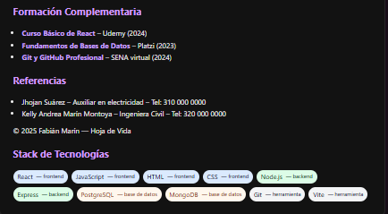

## Cómo ejecutar el proyecto

1. Instalar dependencias:
   npm install

2. Ejecutar:
   npm run dev

# 📄 Hoja de Vida en React – Fabián Marín

Proyecto desarrollado como parte de la actividad **GA1-220501096-03-AA1-EV06-Construcción Componentes dinámicos en React – Renderizado condicional y renderizado de listas**

Este proyecto implementa una **Hoja de Vida modular** construida con **React + Vite**, donde cada sección está separada en componentes individuales, facilitando la reutilización, el mantenimiento y la escalabilidad.

## Descripción
CV dinámico creado con React + Vite que demuestra renderizado condicional y renderizado de listas. Componentes incluidos:
- CabeceraCV
- Perfil
- Experiencia (dinámico)
- Educacion (dinámico)
- StackTecnologias (dinámico con estilos condicionales)

Este ejercicio corresponde a la actividad previa, donde se realizó la construcción de un CV modular utilizando React. En esta actividad se creó un proyecto con React + Vite, organizando la hoja de vida en varios componentes independientes (cabecera, perfil, experiencia, educación y tecnologías). Además, se aplicaron conceptos de anidación de componentes, estructuras dinámicas con .map(), organización de carpetas y uso correcto de Git y GitHub para versionar cada avance del proyecto. Este trabajo permitió afianzar la creación de interfaces basadas en componentes y el flujo básico de un proyecto moderno en React.

## 🖥 Vista previa del proyecto

