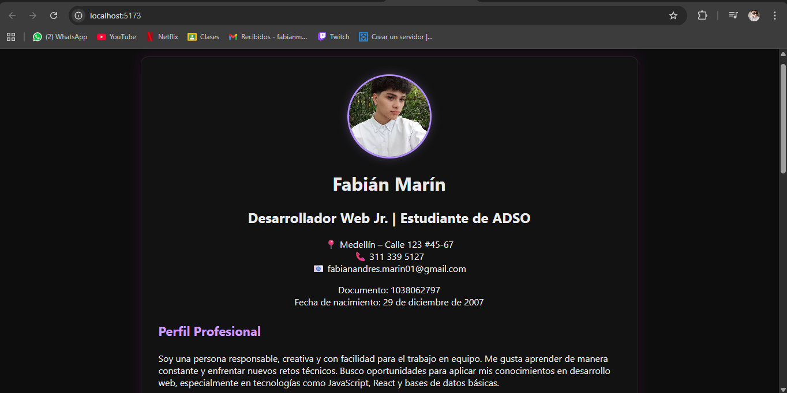

## Cómo ejecutar el proyecto

1. Clonar el repositorio:
   git clone https://github.com/tuusuario/cv-react-nombre-aprendiz

2. Instalar dependencias:
   npm install

3. Ejecutar:
   npm run dev

# 📄 Hoja de Vida en React – Fabián Marín

Proyecto desarrollado como parte de la actividad **GA1-220501096-03-AA1-EV05**:  
**"Construcción de un CV modular en React – Componentes, anidación y control de versiones"**

Este proyecto implementa una **hoja de vida modular** usando **React + Vite**.  
Cada sección del CV está construida como un **componente independiente**, permitiendo una estructura limpia, reutilizable y fácil de mantener.

## 🚀 Tecnologías utilizadas

- React 18
- Vite
- JavaScript (ES6+)
- JSX
- Git & GitHub

## 📁 Estructura del proyecto

src/
├── App.jsx
├── main.jsx
├── index.css
└── components/
├── CabeceraCV.jsx
├── Perfil.jsx
├── Experiencia.jsx
└── Educacion.jsx

Cada archivo dentro de `components/` representa una sección independiente del CV.

## 🧩 Descripción de los componentes

### **1. CabeceraCV.jsx**
Incluye:
- Nombre completo  
- Título profesional  
- Datos de contacto  
- Documento  
- Fecha de nacimiento  

### **2. Perfil.jsx**
- Perfil profesional  
- Habilidades técnicas y blandas  

### **3. Experiencia.jsx**
- 4 proyectos personales y académicos  
- FuSnciones realizadas  

### **4. Educacion.jsx**
- Formación académica  
- Formación complementaria  
- Referencias personales  

## 🖥 Vista previa del proyecto

